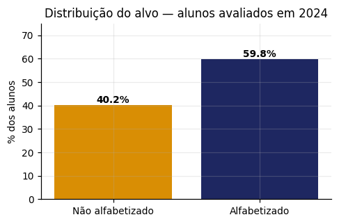
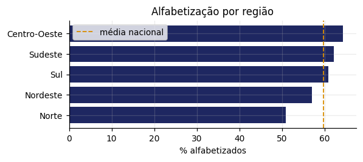
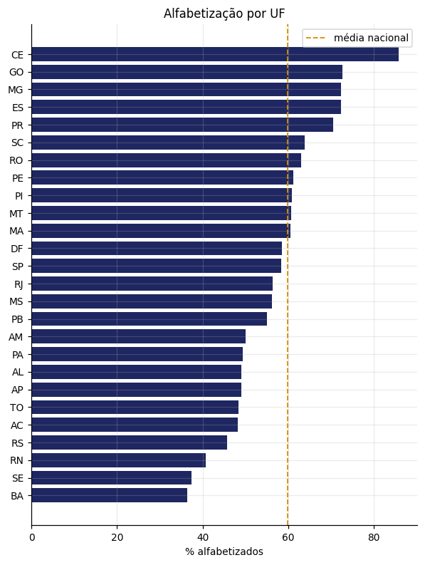
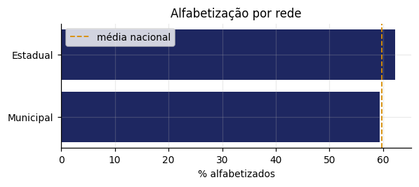
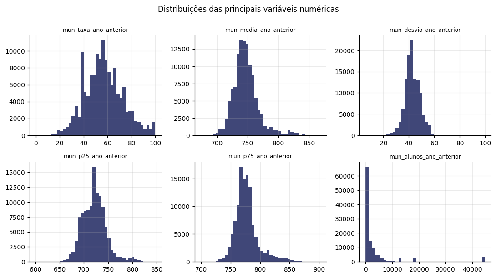
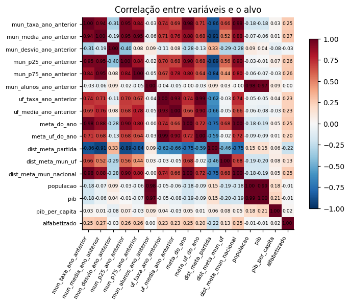
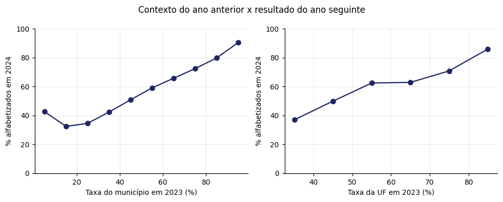

# Análise Exploratória — Alfabetização no 2º ano

Base: **1.851.852 alunos** avaliados em 2024. com contexto educacional de 2023. Gráficos gerados sobre amostra estratificada de 150.000 linhas.

## 1. O alvo

59.8% dos alunos foram classificados como alfabetizados (proficiência ≥ 743 na escala Saeb). O alvo é **equilibrado**, o que dispensa técnicas de balanceamento e permite usar acurácia junto de métricas mais informativas.

## 2. Valores faltantes

Os nulos não são ruído: são **ausência de histórico**. Municípios e escolas que não participaram da avaliação anterior não têm contexto, e a fonte só publica a distribuição por nível de desempenho a partir de 2024.

| variável                |   cobertura (%) |
|:------------------------|----------------:|
| mun_p25_ano_anterior    |           76.80 |
| mun_p75_ano_anterior    |           76.80 |
| mun_desvio_ano_anterior |           76.80 |
| mun_alunos_ano_anterior |           76.80 |
| mun_media_ano_anterior  |           76.80 |
| uf_taxa_ano_anterior    |           76.90 |
| uf_media_ano_anterior   |           76.90 |
| meta_do_ano             |           84.70 |
| dist_meta_mun_uf        |           84.70 |
| dist_meta_partida       |           84.70 |
| dist_meta_mun_nacional  |           84.70 |
| mun_taxa_ano_anterior   |           92.80 |
| meta_uf_do_ano          |           98.30 |

## 3. Padrões por recorte

### Alfabetização por região

| regiao       |   % alfabetizados |   alunos |
|:-------------|------------------:|---------:|
| Centro-Oeste |             64.70 |   175205 |
| Sudeste      |             62.30 |   744637 |
| Sul          |             61.00 |   278403 |
| Nordeste     |             56.90 |   465488 |
| Norte        |             50.80 |   188119 |

### Alfabetização por UF

Maiores taxas: **CE, GO, MG**. Menores: **RN, SE, BA**. A diferença entre a melhor e a pior UF é de 49.3 pontos percentuais.

### Alfabetização por rede

| rede_descricao   |   % alfabetizados |   alunos |
|:-----------------|------------------:|---------:|
| Privada          |             66.70 |       24 |
| Estadual         |             62.50 |   241074 |
| Municipal        |             59.40 |  1610754 |

## 4. Variáveis numéricas

Correlação de cada variável com o alvo:

| variável                |   correlação |
|:------------------------|-------------:|
| mun_media_ano_anterior  |         0.27 |
| mun_p75_ano_anterior    |         0.26 |
| mun_p25_ano_anterior    |         0.26 |
| mun_taxa_ano_anterior   |         0.25 |
| meta_do_ano             |         0.25 |
| dist_meta_mun_nacional  |         0.25 |
| uf_media_ano_anterior   |         0.23 |
| uf_taxa_ano_anterior    |         0.23 |
| dist_meta_partida       |        -0.22 |
| meta_uf_do_ano          |         0.20 |
| dist_meta_mun_uf        |         0.13 |
| mun_desvio_ano_anterior |        -0.03 |
| pib_per_capita          |         0.02 |
| populacao               |        -0.01 |
| pib                     |        -0.01 |
| mun_alunos_ano_anterior |         0.00 |

## 5. O histórico prevê o futuro?

A relação é monótona e forte: quanto maior a taxa da escola e do município no ano anterior, maior a chance de o aluno ser alfabetizado no ano seguinte. É o que sustenta a viabilidade do modelo.

## 6. Uma armadilha da fonte: o código da escola

O microdado traz `id_escola`, mas a coluna é descrita como *máscara de código fictício* — e a máscara é **regerada a cada ano**. Evidências: apenas **3,5%** dos códigos presentes nos dois anos pertencem ao mesmo município, e a taxa de alfabetização por escola correlaciona apenas **0,25** entre 2023 e 2024, contra **0,64** da taxa municipal. Usar o histórico da escola seria alimentar o modelo com ruído. A variável foi descartada; do nível da escola resta apenas o **porte** medido no próprio ano.

## 7. Hipóteses analíticas

1. **O município é a menor unidade de contexto confiável** — o nível da escola existe no dado, mas não é rastreável entre anos.
2. **A desigualdade é regional e estrutural** — a diferença entre UFs supera a diferença entre redes dentro da mesma UF.
3. **A dispersão importa, não só a média** — municípios com desempenho heterogêneo escondem escolas em risco atrás de uma média aceitável.
4. **A meta pactuada carrega informação** — metas mais altas foram atribuídas a municípios com pior ponto de partida.
5. **Sem variáveis individuais, o teto de previsibilidade é o contexto** — o modelo estima o risco do ambiente em que o aluno está, não o desempenho pessoal dele.
