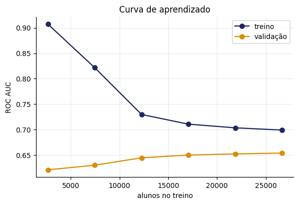
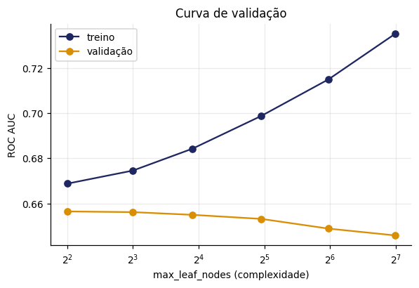
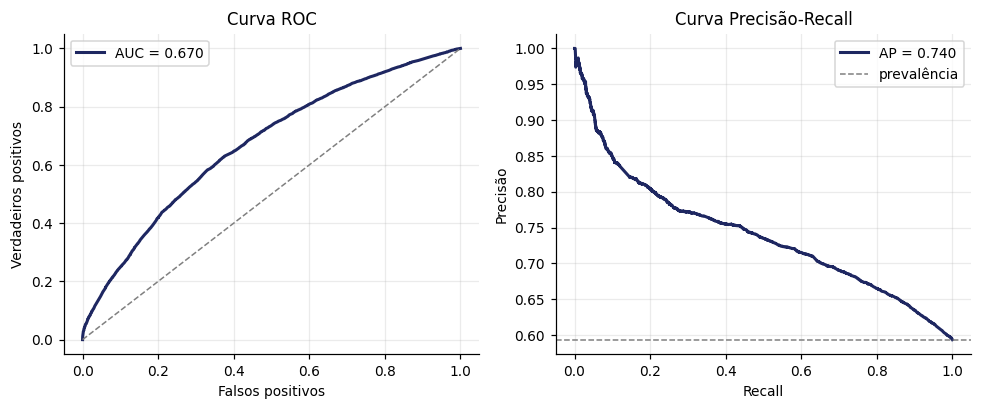
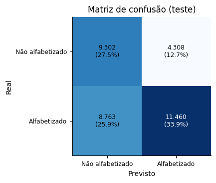
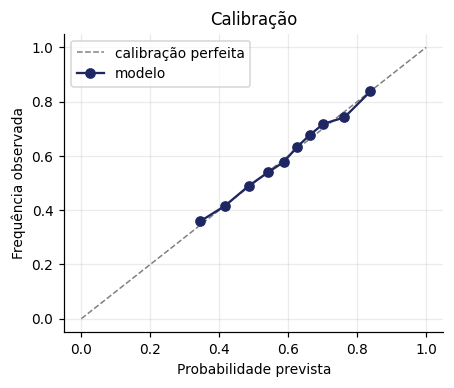
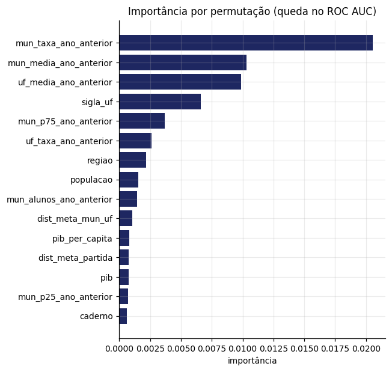
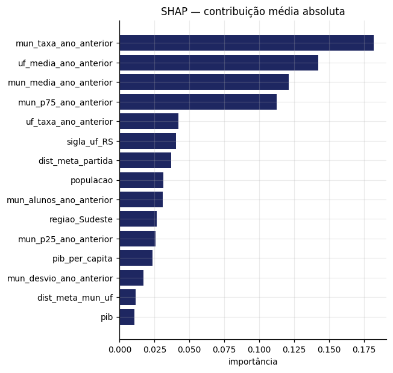
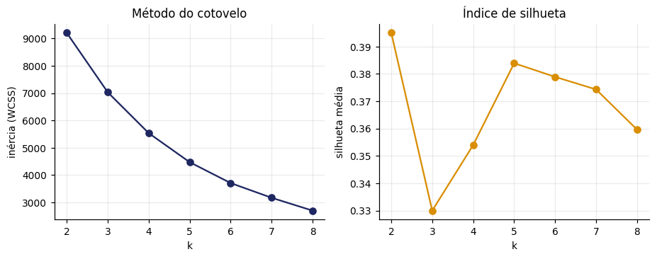
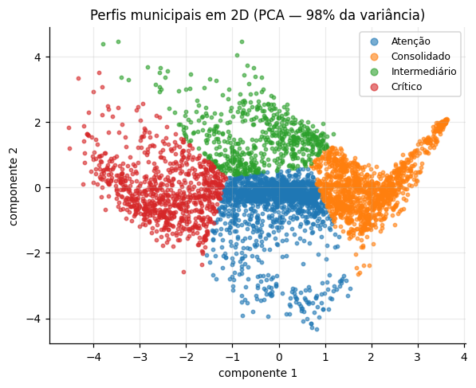
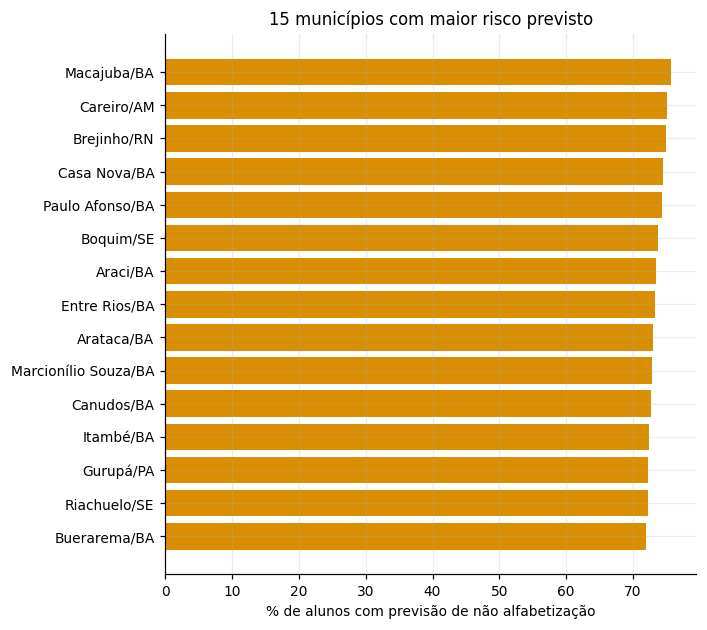

# Modelagem — Predição de Alfabetização

## 1. Desenho do experimento

- **Unidade**: um aluno avaliado em 2024 (2º ano do EF)
- **Alvo**: alfabetizado (proficiência ≥ 743 na escala Saeb)
- **Treino**: 116.167 alunos em 4.037 municípios
- **Teste**: 33.833 alunos em 1.346 municípios
- **Separação**: por **município** (GroupShuffleSplit). Nenhum município aparece nos dois conjuntos — o teste mede generalização para municípios que o modelo nunca viu.

## 2. Comparação de algoritmos

Validação cruzada agrupada por município, 5 dobras:

| modelo              |   roc_auc |   roc_auc_dp |   roc_auc_treino |   gap_treino_validacao |   acuracia |     f1 |   pr_auc |   tempo_s |
|:--------------------|----------:|-------------:|-----------------:|-----------------------:|-----------:|-------:|---------:|----------:|
| gradient_boosting   |    0.6543 |       0.0102 |           0.6802 |                 0.0259 |     0.6356 | 0.7320 |   0.7342 |    5.9000 |
| random_forest       |    0.6537 |       0.0100 |           0.6847 |                 0.0310 |     0.6349 | 0.7302 |   0.7364 |    3.5000 |
| regressao_logistica |    0.6482 |       0.0175 |           0.6582 |                 0.0101 |     0.6249 | 0.7166 |   0.7339 |    2.1000 |
| svm_linear          |    0.6463 |       0.0164 |           0.6584 |                 0.0122 |     0.6245 | 0.7226 |   0.7309 |    4.5000 |
| arvore_decisao      |    0.6427 |       0.0083 |           0.6688 |                 0.0262 |     0.6269 | 0.7202 |   0.7184 |    1.9000 |
| naive_bayes         |    0.6276 |       0.0153 |           0.6439 |                 0.0162 |     0.6098 | 0.6936 |   0.7154 |    1.1000 |
| baseline            |    0.5000 |       0.0000 |           0.5000 |                 0.0000 |     0.5979 | 0.7483 |   0.5979 |    0.8000 |

O *baseline* (classe majoritária) confirma o piso de 0,5 de ROC AUC. As seis famílias de algoritmo ficam próximas, e o gap treino–validação é pequeno em todas: o limite é a **informação disponível**, não a capacidade do modelo nem sobreajuste.

### Ablação: o enriquecimento socioeconômico serve?

| modelo              |   com_ibge |   sem_ibge |   diferenca |
|:--------------------|-----------:|-----------:|------------:|
| gradient_boosting   |     0.6543 |     0.6539 |      0.0004 |
| random_forest       |     0.6537 |     0.6534 |      0.0003 |
| regressao_logistica |     0.6482 |     0.6477 |      0.0005 |
| svm_linear          |     0.6463 |     0.6485 |     -0.0022 |
| arvore_decisao      |     0.6427 |     0.6435 |     -0.0008 |
| naive_bayes         |     0.6276 |     0.6334 |     -0.0058 |
| baseline            |     0.5000 |     0.5000 |      0.0000 |

Mesma amostra, mesmo split e mesmas dobras; a única diferença são as colunas do IBGE. As diferenças de ROC AUC ficam entre -0.0058 e +0.0005, abaixo do desvio entre dobras de qualquer um dos algoritmos. As variáveis foram mantidas porque a integração socioeconômica é requisito do projeto, mas o sinal que elas carregam já está nas variáveis de desempenho territorial.

### Diagnóstico de viés e variância

O último passo da curva acrescenta 22% de exemplos (21.866 → 26.666) e rende **+0.0017 de AUC**: o retorno marginal do volume já é desprezível *no intervalo avaliado*. Isso não demonstra que mais dados nunca ajudariam — exigiria estender a curva bem além deste limite. A curva de validação aponta o ótimo em **4 folhas**: o sinal é simples.





## 3. Hiperparâmetros e desempenho final

Melhores parâmetros (busca aleatória, 10 combinações):

```
{
  "modelo__min_samples_leaf": 100,
  "modelo__max_leaf_nodes": 15,
  "modelo__max_iter": 300,
  "modelo__learning_rate": 0.03,
  "modelo__l2_regularization": 1.0
}
```

Desempenho no conjunto de teste, ponderado pelo peso amostral, no limiar **0.62** (escolhido na validação do treino com alvo de recall para a classe *não alfabetizado*):

|   roc_auc |   pr_auc |   acuracia |   brier |
|----------:|---------:|-----------:|--------:|
|    0.6695 |   0.7399 |     0.6108 |  0.2209 |

Por classe — a que interessa sinalizar é a **negativa**:

| classe           |   precisão |   recall |     F1 |
|:-----------------|-----------:|---------:|-------:|
| alfabetizado     |     0.7227 |   0.5585 | 0.6301 |
| nao_alfabetizado |     0.5160 |   0.6872 | 0.5894 |







O Brier score de 0.2209 e a curva de calibração mostram que as probabilidades previstas são utilizáveis como **medida de risco**, não apenas como classificação binária.

## 4. Interpretabilidade

### Importância por permutação (queda no ROC AUC)

| variavel                |   importancia |
|:------------------------|--------------:|
| mun_taxa_ano_anterior   |       0.02056 |
| mun_media_ano_anterior  |       0.01031 |
| uf_media_ano_anterior   |       0.00986 |
| sigla_uf                |       0.00660 |
| mun_p75_ano_anterior    |       0.00369 |
| uf_taxa_ano_anterior    |       0.00262 |
| regiao                  |       0.00217 |
| populacao               |       0.00155 |
| mun_alunos_ano_anterior |       0.00146 |
| dist_meta_mun_uf        |       0.00103 |



### SHAP (contribuição média absoluta)

| variavel                |   shap_medio |
|:------------------------|-------------:|
| mun_taxa_ano_anterior   |      0.18207 |
| uf_media_ano_anterior   |      0.14244 |
| mun_media_ano_anterior  |      0.12109 |
| mun_p75_ano_anterior    |      0.11237 |
| uf_taxa_ano_anterior    |      0.04206 |
| sigla_uf_RS             |      0.04030 |
| dist_meta_partida       |      0.03704 |
| populacao               |      0.03136 |
| mun_alunos_ano_anterior |      0.03085 |
| regiao_Sudeste          |      0.02659 |



As duas técnicas concordam no topo: **`mun_taxa_ano_anterior`** é a mais influente pelos dois métodos, seguida de `uf_media_ano_anterior`. A concordância entre métodos independentes reforça que o sinal é real e não artefato de um algoritmo específico.

## 5. Aplicação estratégica

Previsões *out-of-fold* agregadas em **4.189 unidades município × rede** (3.818 municípios distintos). A agregação é por rede porque a meta é pactuada por rede; cada unidade é prevista por um modelo que não viu aquele município no treino.

### Risco de não atingir a meta

**1.746 de 3.656 unidades com meta pactuada (47.8%)** têm indicador previsto abaixo da meta de 2024. Outras 533 unidades não têm meta e ficam classificadas como *não avaliáveis* — não como sem risco.

### Validação do produto final

Erro da taxa municipal prevista: **MAE de 8.33 p.p.** (RMSE 11.0). contra **11.04 p.p.** da regra ingênua *repetir o indicador do ano anterior* — 4.092 unidades comparadas. É este número. e não o ROC AUC por aluno. que justifica usar o ranking para priorização.

### Risco médio por região (%)

| região       |   risco (%) |
|:-------------|------------:|
| Norte        |        48.5 |
| Nordeste     |        43.8 |
| Sul          |        36.8 |
| Centro-Oeste |        32.3 |
| Sudeste      |        31.7 |

### Perfis de município (k-means)

| nome_perfil   |   municipios |   indicador_previsto |   taxa_ano_anterior |   meta_do_ano |
|:--------------|-------------:|---------------------:|--------------------:|--------------:|
| Atenção       |         1571 |                 58.9 |                59.7 |          63.0 |
| Consolidado   |         1223 |                 78.9 |                79.7 |          76.5 |
| Crítico       |          822 |                 39.6 |                34.6 |          41.3 |
| Intermediário |          573 |                 64.6 |                49.0 |          53.9 |

k adotado = **4** (silhueta 0.3540). A silhueta é máxima em k=2; a escolha de 4 perfis é de negócio, não estatística — cada um corresponde a uma ação distinta, enquanto k=2 apenas separaria acima e abaixo da média.





### Unidades com maior risco previsto

| nome_municipio    | sigla_uf   | rede_descricao   |   indicador_previsto |   meta_do_ano |   alunos |
|:------------------|:-----------|:-----------------|---------------------:|--------------:|---------:|
| Macajuba          | BA         | Municipal        |                 24.3 |          25.6 |       43 |
| Careiro           | AM         | Municipal        |                 24.8 |         nan   |       33 |
| Brejinho          | RN         | Municipal        |                 25.1 |         nan   |       21 |
| Casa Nova         | BA         | Municipal        |                 25.5 |          19.4 |      149 |
| Paulo Afonso      | BA         | Municipal        |                 25.7 |          32.0 |      306 |
| Boquim            | SE         | Municipal        |                 26.2 |          30.0 |       49 |
| Araci             | BA         | Municipal        |                 26.6 |          27.4 |      111 |
| Entre Rios        | BA         | Municipal        |                 26.8 |         nan   |       80 |
| Arataca           | BA         | Municipal        |                 27.0 |          23.7 |       25 |
| Marcionílio Souza | BA         | Municipal        |                 27.1 |          28.3 |       28 |
| Canudos           | BA         | Municipal        |                 27.4 |          25.9 |       52 |
| Itambé            | BA         | Municipal        |                 27.7 |          29.4 |       92 |
| Gurupá            | PA         | Municipal        |                 27.7 |         nan   |      146 |
| Riachuelo         | SE         | Municipal        |                 27.8 |          17.3 |       29 |
| Buerarema         | BA         | Municipal        |                 28.0 |          31.5 |       33 |


